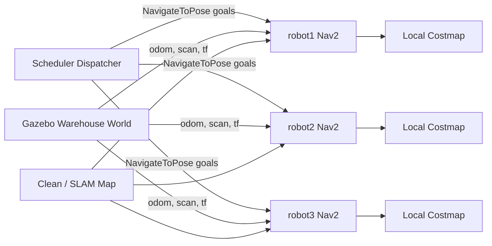

# Warehouse Robot Simulator

A ROS 2 warehouse robotics simulation where multiple TurtleBot agents receive pickup/dropoff jobs, navigate around shelves with Nav2, and avoid nearby moving robots using LiDAR-fed local costmaps.

The project is built as a robotics + software systems project: the robots use ROS 2, Gazebo, RViz, Nav2, AMCL, and map data, while a custom dispatcher behaves like a small operating-system scheduler for warehouse delivery jobs.

## Highlights

- Multi-robot TurtleBot simulation in a custom warehouse world
- Three namespaced robots: `robot1`, `robot2`, and `robot3`
- Nav2 navigation with AMCL localization and local/global costmaps
- Static obstacle avoidance around warehouse shelves and walls
- Dynamic avoidance of nearby robots through local costmap obstacle updates
- Custom job dispatcher with OS-inspired scheduling:
  - job queue
  - shortest-job-first priority scoring
  - aging to prevent starvation
  - deadhead-distance penalty to prefer nearby robots
  - retries for failed jobs
  - robot state tracking and periodic scheduler snapshots
- SLAM-generated proof map plus a clean generated map for repeatable Nav2 testing

## Tech Stack

- ROS 2 Jazzy
- Gazebo Sim
- RViz2
- Nav2
- AMCL
- SLAM Toolbox
- TurtleBot3
- Python ROS nodes (`rclpy`)

## Project Structure

```text
warehouse_robot_sim/
  launch/
    multi_robot_world.launch.py        # Gazebo warehouse + 3 TurtleBots
    multi_robot_navigation.launch.py   # Nav2 stacks for all robots
    warehouse_world.launch.py          # Single-world launch helpers
    navigation.launch.py               # Single-robot Nav2 launch

  config/
    nav2_params_robot1.yaml
    nav2_params_robot2.yaml
    nav2_params_robot3.yaml
    nav2_params.yaml

  maps/
    warehouse_map.yaml/.pgm            # SLAM-generated map
    clean_warehouse_map.yaml/.pgm      # Generated clean map for stable demos

  worlds/
    warehouse.world                    # Custom warehouse with 6 shelf stations

  scripts/
    generate_clean_warehouse_map.py    # Builds the clean occupancy grid map

  warehouse_robot_sim/
    multi_robot_dispatcher_node.py     # Scheduler-style dispatcher
    initial_pose_publisher_node.py     # AMCL initial pose helper
    delivery_task_node.py              # Earlier single-task navigation node
    job_dispatcher_node.py             # Earlier single-robot dispatcher
```

## Warehouse Layout

The warehouse has six shelf stations. Each station can act as a pickup or dropoff location.

```text
A1     A2     A3

   main driving aisle

B1     B2     B3
```

Current station waypoints:

| Station | x | y | yaw |
|---|---:|---:|---:|
| A1 | -4.0 | 0.75 | -1.57 |
| A2 | 0.0 | 0.75 | -1.57 |
| A3 | 4.0 | 0.75 | -1.57 |
| B1 | -4.0 | -0.75 | 1.57 |
| B2 | 0.0 | -0.75 | 1.57 |
| B3 | 4.0 | -0.75 | 1.57 |

## System Architecture



## Scheduler Design

The dispatcher models a simplified warehouse job scheduler.

Each job has:

- pickup station
- dropoff station
- creation time
- attempt count
- estimated service distance

The scheduler chooses jobs using an effective score:

```text
score =
  job_service_distance
  + deadhead_weight * robot_to_pickup_distance
  + retry_penalty
  - aging_weight * time_waiting
```

Lower score wins.

This creates shortest-job-first behavior while still preventing starvation. Long jobs become more attractive the longer they wait in the queue.

## Setup

This project was developed in WSL Ubuntu with ROS 2 Jazzy.

Source ROS and the workspace before running commands:

```bash
cd /mnt/c/Users/jayce/warehouse_robot_sim
source /opt/ros/jazzy/setup.bash
source install/setup.bash
```

Build:

```bash
cd /mnt/c/Users/jayce/warehouse_robot_sim
source /opt/ros/jazzy/setup.bash
colcon build --symlink-install
source install/setup.bash
```

## Running The Demo

Use three terminals.

### Terminal 1: Gazebo World

```bash
cd /mnt/c/Users/jayce/warehouse_robot_sim
source /opt/ros/jazzy/setup.bash
source install/setup.bash
ros2 launch warehouse_robot_sim multi_robot_world.launch.py
```

### Terminal 2: Nav2 For All Robots

```bash
cd /mnt/c/Users/jayce/warehouse_robot_sim
source /opt/ros/jazzy/setup.bash
source install/setup.bash
ros2 launch warehouse_robot_sim multi_robot_navigation.launch.py
```

Wait for Nav2 to activate and for initial pose publishing to finish.

### Terminal 3: Scheduler Dispatcher

Run with random jobs:

```bash
cd /mnt/c/Users/jayce/warehouse_robot_sim
source /opt/ros/jazzy/setup.bash
source install/setup.bash
ros2 run warehouse_robot_sim multi_robot_dispatcher_node --ros-args -p use_sim_time:=true
```

Run with deterministic jobs:

```bash
ros2 run warehouse_robot_sim multi_robot_dispatcher_node --ros-args -p use_sim_time:=true -p max_jobs:=6 -p job_interval_sec:=3.0 -p assignment_stagger_sec:=0.5 -p job_sequence:="['A1:B3', 'A3:B1', 'A2:B2', 'B1:A3', 'B3:A1', 'A1:B1']"
```

## Useful Dispatcher Parameters

| Parameter | Default | Meaning |
|---|---:|---|
| `robots` | `['robot1', 'robot2', 'robot3']` | Robot namespaces to dispatch to |
| `job_interval_sec` | `4.0` | How often random jobs are generated |
| `max_jobs` | `9` | Maximum generated jobs before dispatcher exits |
| `pickup_wait_sec` | `1.5` | Simulated loading time at pickup |
| `assignment_stagger_sec` | `1.0` | Delay between assigning jobs to different robots |
| `aging_weight` | `0.08` | Starvation-prevention strength |
| `deadhead_weight` | `0.25` | Penalty for assigning a faraway robot |
| `retry_limit` | `1` | Retry attempts before permanent failure |
| `retry_delay_sec` | `3.0` | Delay before failed jobs re-enter the queue |
| `job_sequence` | `[]` | Optional deterministic list like `['A1:B3']` |

## Verifying Nav2 Dynamic Avoidance

In RViz, add these displays by topic:

```text
/robot1/local_costmap/costmap
/robot2/local_costmap/costmap
/robot3/local_costmap/costmap
/robot1/scan
/robot2/scan
/robot3/scan
```

Nav2 dynamic avoidance is visible when:

1. Another robot enters laser range.
2. The robot appears as a black occupied dot/blob in the local costmap.
3. The robot slows, curves, pauses, or replans.
4. The obstacle moves away.
5. The robot continues toward its goal.

Because each robot publishes TF in its own namespace, RViz may need TF remapping when inspecting a specific robot:

```bash
rviz2 --ros-args -r /tf:=/robot1/tf -r /tf_static:=/robot1/tf_static -p use_sim_time:=true
```

For robot2 or robot3, replace `robot1` with the desired namespace.

## Maps

This project uses two maps:

- `warehouse_map.yaml`: generated with SLAM Toolbox as proof of mapping workflow
- `clean_warehouse_map.yaml`: generated from known warehouse geometry for reliable Nav2 demos

The clean map can be regenerated with:

```bash
cd /mnt/c/Users/jayce/warehouse_robot_sim/src/warehouse_robot_sim/warehouse_robot_sim
python3 scripts/generate_clean_warehouse_map.py
```

## Resume Summary

Example resume bullet:

```text
Built a ROS2/Nav2 multi-robot warehouse simulation with TurtleBot agents, LiDAR-based local costmaps, AMCL localization, and an OS-inspired scheduler that assigns pickup/dropoff jobs using shortest-job-first priority with aging and retry handling.
```

## Future Improvements

Good next software-engineering extensions:

- Add policy comparison modes: FIFO, round-robin, shortest-job-first, SJF with aging
- Export job metrics to CSV/JSON
- Track average wait time, throughput, retries, and robot utilization
- Add a small dashboard for queue and robot state
- Add a job-submission API or command-line job client
- Add moving people/cylinders as dedicated dynamic obstacles
- Add README screenshots/GIFs of RViz local costmap avoidance

